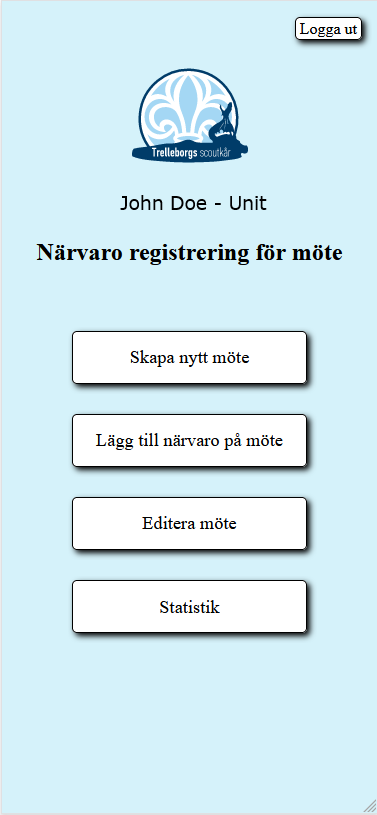

This project is designed to help out with attendence register at our scoutmeeting and complie the
statistics for easy reading and reporting to the township. Register part is made for mobile first.

# Project description
```
API is Node Express with Typescript and Frontend with Vue3, login is handled with Google Login
Importing the register from scoutnet.se
```

## Images




## Project setup

```
npm install
```

### Compiles and hot-reloads for development

```
Frontend: npm run serve
API: npm run dev
```
